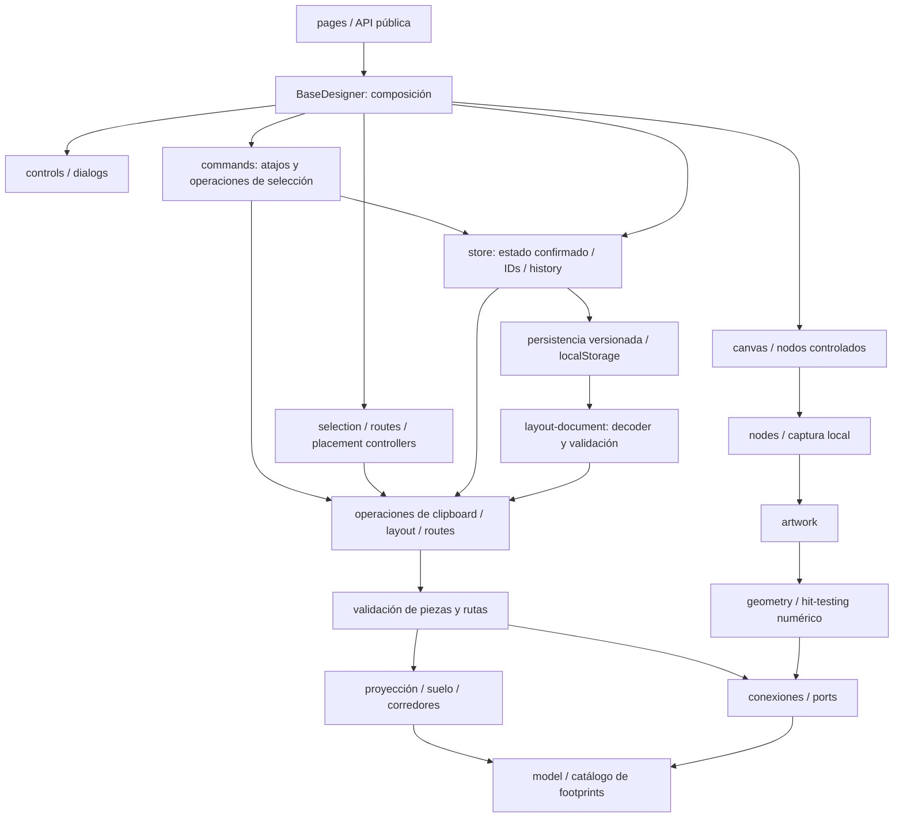

# Base Designer

Editor de layout con guardado automático local. React Flow controla viewport y nodos de estaciones/notas; las piezas y conexiones se representan sobre una rejilla propia. No hay grafo de edges/handles de React Flow ni simulación de caudales.

La API pública es [index.ts](index.ts), que expone BaseDesigner. Los consumidores externos entran por ella; los módulos internos importan contratos concretos, sin fachadas de reexports.

## Estructura

```text
base-designer/
├── index.ts
├── model/                  # catálogo visual, selección y contratos de nodo
├── lib/
│   ├── geometry/           # proyección numérica, hit-testing, selección de área
│   ├── layout/             # suelo, propietarios, transforms, validación, snapshot
│   ├── routes/             # anclas, túneles, validación y propuestas de rutas
│   ├── connections/        # reglas dirigidas, puertos y fases de animación
│   ├── clipboard/          # snapshots, geometría del ghost y materialización
│   └── products/           # catálogo, inputs conocidos, recetas, comparación
├── ui/
│   ├── base-designer.tsx   # composición, herramienta/contexto y arbitraje global
│   ├── canvas/             # React Flow, captura, adaptación de nodos y pan
│   ├── nodes/              # nodos de estación/nota y gestos de rejilla
│   ├── selection/          # propietario de selección explícita
│   ├── placement/          # sesiones de movimiento, construcción y paste
│   ├── routes/             # sesión de dibujo de rutas
│   ├── commands/           # dispatch común y Copy/Cut/Paste/Delete
│   ├── artwork/            # SVG, tiles, frames y marcas de puertos
│   ├── controls/           # toolbar y panel superpuesto de conteos
│   └── dialogs/            # targets, lifecycle y controles de edición
└── styles/                 # entrada CSS y dominios de artwork
```

El listado de items sigue las etapas de producción del plan comparado. Al abrir Bases directamente, usa la cadena completa del catálogo y las recetas asignadas, incluyendo intermediarios aunque no haya máquinas para ellos; esto ordena filas, no demuestra suministro.

El adaptador de estado confirmado está en [src/store/base-designer.store.ts](../../store/base-designer.store.ts), conforme a la estructura del repositorio.

## Dónde encontrar cada capacidad

| Capacidad                                     | Punto de entrada                                                                                                                                                                                               |
| --------------------------------------------- | -------------------------------------------------------------------------------------------------------------------------------------------------------------------------------------------------------------- |
| Composición y prioridades de cancelación/giro | [BaseDesigner](ui/base-designer.tsx)                                                                                                                                                                           |
| Selección de nodos/pieza/área                 | [useEditorSelection](ui/selection/use-editor-selection.ts), contrato en [editor-selection](model/editor-selection.ts)                                                                                          |
| Shift-drag y movimiento de piezas/rutas       | [useStationInteractions](ui/nodes/use-station-interactions.ts); intersección pura en [selection-geometry](lib/geometry/selection-geometry.ts)                                                                  |
| Ctrl+V y demás shortcuts                      | [useEditorCommands](ui/commands/use-editor-commands.ts) → [useSelectionCommands](ui/commands/use-selection-commands.ts)                                                                                        |
| Copy/Cut/Delete y confirmación                | [useSelectionCommands](ui/commands/use-selection-commands.ts), snapshots en [clipboard](lib/clipboard/clipboard.ts), borrado en [removal](lib/layout/removal.ts)                                               |
| Paste, ghost, confirmación y cancelación      | [usePlacementPreview](ui/placement/use-placement-preview.ts), geometría en [clipboard-preview](lib/clipboard/clipboard-preview.ts), artwork en [layout-paste-preview](ui/placement/layout-paste-preview.tsx)   |
| Materialización de copias e IDs               | [clipboard-operations](lib/clipboard/clipboard-operations.ts)                                                                                                                                                  |
| Construcción y movimiento de nodos            | [useStationPlacement](ui/placement/use-station-placement.ts), [useNodeMovement](ui/placement/use-node-movement.ts)                                                                                             |
| Rotate, pivotes y transforms                  | [layout-transform](lib/layout/layout-transform.ts); prioridad del comando en BaseDesigner                                                                                                                      |
| Coordenadas, hit-testing y propietarios       | [station-spatial](lib/geometry/station-spatial.ts), [world-layout](lib/layout/world-layout.ts), [stations](lib/layout/stations.ts)                                                                             |
| Dibujo y validación de rutas/túneles          | [useRouteDrawing](ui/routes/use-route-drawing.ts), [route-operations](lib/routes/route-operations.ts), [route-validation](lib/routes/route-validation.ts)                                                      |
| Conexiones, I/O y flujos visuales             | [connections](lib/connections/connections.ts), [ports](lib/connections/ports.ts), [belt-flow](lib/connections/belt-flow.ts)                                                                                    |
| Canvas, viewport y nodos controlados          | [BaseCanvas](ui/canvas/base-canvas.tsx), [useCanvasPan](ui/canvas/use-canvas-pan.ts), [useCanvasNodes](ui/canvas/use-canvas-nodes.ts)                                                                          |
| Toolbar, conteos y diálogos                   | [BaseToolbar](ui/controls/base-toolbar.tsx), [BaseBuildingsPanel](ui/controls/base-buildings-panel.tsx), [useEditorDialogs](ui/dialogs/use-editor-dialogs.ts), [EditorDialogs](ui/dialogs/editor-dialogs.tsx)  |
| Catálogo, energía, productos y comparación    | [catalog-machines](lib/products/catalog-machines.ts), [machine-inputs](lib/products/machine-inputs.ts), [machine-recipes](lib/products/machine-recipes.ts), [plan-comparison](lib/products/plan-comparison.ts) |
| Estado confirmado, transacciones y Undo/Redo  | [store](../../store/base-designer.store.ts)                                                                                                                                                                    |
| Estilos de React Flow y artwork               | [base-designer.css](styles/base-designer.css), [ui/artwork](ui/artwork/)                                                                                                                                       |

## Dirección de dependencias



El grafo muestra las dependencias principales, no todas las aristas. `layout-transform` combina geometría y validación de dominio; `station-spatial` conoce puertos/rutas, pero recibe puntos y bounds numéricos sin leer el DOM. Las operaciones de paste/ruta consumen un allocator explícito sólo después de validar; snapshots, geometría y validadores permanecen puros.

UI → controller/hook → operación de dominio → validación/proyección. El store es el adaptador de transacciones y también consume dominio. `lib/` no importa React, HeroUI, hooks ni stores; `model/station-node.ts` contiene el contrato del adaptador React Flow, no cálculos de dominio.

- `placement-validation → route-validation → world-layout → stations/placement`. La proyección no importa validadores ni los reexporta.
- `belt-flow` y `machine-inputs` consumen las reglas de conexiones; las conexiones no dependen de animación ni del seguimiento de productos.
- `lib/products/` consulta el catálogo normalizado de `shared/data`; la comparación consume contratos y summarizeRequiredBuildings de la API pública de Planner, compartiendo el recuento físico con sus estadísticas y costes de construcción.
- `lib/geometry/` recibe puntos y bounds numéricos. Leer elementos, aplicar viewport y atender eventos pertenece a UI.

Graphify ayuda a navegar relaciones, pero sus enlaces semánticos no prueban la dirección de imports runtime. El script local opcional `scripts/check-architecture.mjs` comprueba boundaries y ciclos sobre los imports del código vigente; está ignorado en Git y no se ejecuta en CI.

## Estado y transacciones

| Información                                                  | Propietario                                                                                 |
| ------------------------------------------------------------ | ------------------------------------------------------------------------------------------- |
| Estaciones, placements locales, notas y 50 snapshots de Undo | Store: plano en localStorage; historial sólo de sesión                                      |
| Selección explícita y sus IDs/sets derivados                 | useEditorSelection                                                                          |
| Clipboard y confirmación pendiente de Cut/Delete             | useSelectionCommands                                                                        |
| Herramienta, estación de contexto y arbitraje entre sesiones | BaseDesigner                                                                                |
| Paleta, IDs de targets, slot de dron y trigger de Product    | useEditorDialogs; entidades derivadas de stations                                           |
| Captura, hover, draft y preview                              | El hook de cada gesto; no el store                                                          |
| Viewport                                                     | React Flow                                                                                  |
| Medidas de notas controladas                                 | useCanvasNodes                                                                              |
| Mundo, corredores, ocupación y fases de cintas               | [createLayoutView](lib/layout/layout-view.ts), memoizado por renderStations en BaseDesigner |

El flujo de escritura es **propuesta UI → validación del layout vigente → commit del store**. El store asigna IDs después de validar y registra una transacción aceptada con su historial compartido. Movimiento cancelado, inválido o de ida y vuelta no añade Undo. Las notas mantienen draft local y confirman al blur.

Las refs de gesto permiten atender eventos sin closures obsoletas y el estado React representa esa misma sesión para pintarla. Ambos se actualizan dentro de un único propietario; no representan dos layouts confirmados. `activeStationId` es contexto, nunca la fuente de selección para highlights o clipboard.

### Guardado local

El store principal compone `src/store/base-designer/`: `layout-actions` (plano/notas e historial), `placement-actions` (piezas/rutas/paste), `product-actions` (recetas, I/O y drones), `history` (transacción común) y `persistence` (almacenamiento). No introduce otros propietarios del plano.

`mainsequence-base-layout` guarda un documento versión 1 con **stations y notes**; posiciones de módulos/notas en píxeles flow y piezas en células locales. `layout-document` decodifica datos desconocidos, permite sólo campos confirmados y reutiliza validadores de suelo/rutas. IDs UUID nuevos evitan colisiones después de recargar; los IDs existentes se conservan.

Zustand hidrata el plano al crear el store. No restaura acciones, selección, clipboard, medidas React Flow ni historial. Cada commit, Undo o Redo guarda el resultado; las previews no escriben y los cambios sólo de sesión no vuelven a serializar el plano. Las notas confirman al salir del campo.

Un JSON dañado, una geometría inválida o una versión futura se conserva sin sobrescribir; el editor muestra un aviso y mantiene las nuevas ediciones sólo en memoria. Una cuota agotada o storage bloqueado tampoco interrumpe la edición y se reintenta en el siguiente commit. Si otra pestaña cambia el archivo, esta pestaña bloquea el guardado y avisa para evitar sobrescribir el plano más reciente. No hay sincronización entre dispositivos/tabs ni catálogo de múltiples planos. Limpiar los datos del sitio borra la base.

## Selección, clipboard y ghost

EditorSelection distingue nodos, pieza, área o null. React Flow comunica cambios a useEditorSelection sin effects de sincronización. Shift-drag conserva captura, umbral y rectángulo local en useStationInteractions; al soltar, selectionAreaIds recibe límites world semiabiertos, intersecta footprints y expande rutas completas por routeId, incluidas células enterradas. El clic individual da prioridad a superficie sobre células enterradas. Delete sigue IDs, nunca coordenadas.

createClipboardPayload crea un snapshot independiente. Nodos copian contenido dentro de su límite y locks internos; una pieza/ruta que requiere módulos no seleccionados se omite entera y Paste describe la omisión. No se amplía automáticamente la selección. Copiar un tramo incluye la ruta completa; áreas conservan sus IDs seleccionados. Copy admite varios nodos; Cut/Delete no.

useSelectionCommands llama a cancelEditing antes de iniciar otra operación. Paste elige el último punto client del puntero o el centro del canvas, enfoca el canvas y entrega el payload a usePlacementPreview. Cut publica clipboard sólo después de una eliminación aceptada; cancelar/rechazar la confirmación conserva la copia anterior. La confirmación vuelve a consultar contenidos confirmados.

usePlacementPreview posee una única sesión discriminada: layout, placements o null. Layout guarda draft/pivot/pointer en píxeles de flow; placements guarda source, turns y cursor en células world. Ambas variantes comparten confirmación, cancelación y captura; no hay un adaptador de paste separado.

createLayoutPasteGeometry prepara artwork de canvas sin nodos editables ni medidas RF; prefija IDs para distinguir originales y ghost. Un ghost inválido muestra sólo corredores internos. createLayoutPaste/createPlacementPaste revalidan el conjunto antes de consumir el allocator del store, remapear IDs/rutas/locks y confirmar una sola entrada de history. El ghost se repite tras cada pegado hasta cancelar; su validez visual no autoriza el commit.

## Coordenadas y giros

- **Client:** píxeles de pantalla; `screenToFlowPosition` aplica el viewport.
- **Flow:** píxeles del plano para estaciones/notas; CELL_SIZE equivale a 20 px por célula.
- **World cells:** flow dividido por CELL_SIZE; el cursor usa floor, también en coordenadas negativas.
- **Station-local cells:** placements relativos a su propietario. worldPlacements añade offset y stationId temporal.

layout-transform mantiene giros de cuarto de vuelta sobre la rejilla y un pivot fijo durante cada gesto. Rutas completas, direction/incoming/extraIncoming y permisos de output giran juntos. Las notas orbitan sin girar su texto. Mover un suelo incluye módulos ligados; copiar no incluye vecinos automáticamente.

Al materializar una propuesta world, restar el offset del nuevo propietario y retirar stationId con withoutStationOwner. Esa metadata no pertenece a BasePlacement local. BeltTile/MachineTile reciben placement, occupied y canTraverse en un mismo marco; insets, escala de iconos y grosor SVG nunca cambian huellas o hitboxes.

## Rutas, conexiones y productos

useRouteDrawing recibe células locales desde nodos y conserva anclas/hover en world cells. [route](lib/routes/route.ts) proyecta segmentos ortogonales horizontal-first y [underground](lib/routes/underground.ts) define límites de túneles. Hover deriva feedback; confirmar usa anclas aceptadas y createRoutePlacement valida suelo, propietarios, tier, túnel y unión lateral antes de asignar IDs. Merge sólo admite rutas normales del mismo tier; la poda elimina junctions explícitos desconectados en la misma transacción.

Derecho retira una ancla, incluida la inicial; Escape cancela el draft. Right-drag sólo hace pan y suprime su contextmenu. R puede transferir una ruta en preview al propietario de placement. Los túneles exponen sólo primera entrada y última salida: sus células buried no ocupan superficie.

Las conexiones son relaciones espaciales dirigidas de dominio. Una cinta MK1/MK2 lateral recibe salida automática de un I/O alineado de máquina, sin persistir junctions. Una cinta que apunta a la máquina sigue entrando. F/Outputs deshabilitan sólo la entrega saliente; splitters y túneles conservan puertos explícitos. Dibujo, artwork y seguimiento de productos comparten estas reglas.

connectedProductionBelts recorre hacia receptores para derivar fases visuales; knownMachineInputItems recorre proveedores para obtener labels, con IDs visitados para detener ciclos. withBuriedBeltFlows extiende sólo artwork, no ocupación de superficie. Las fases usan el SVG de 20 unidades, sin representar caudal.

Los productos siguen derivados: inputs conocidos filtran recetas compatibles, sin inputs se muestra el catálogo compatible completo. Cambiar conexiones no borra asignaciones. catalog-machines relaciona tipos visuales e IDs estables de Crafter (`assembler` corresponde a `fabricator`); no crea otro catálogo. Energía suma MJ nominales conocidos, mostrando desconocidos aparte, sin escalado de utilización ni generación inventada. La comparación mantiene objetivos netos de Planner y salida bruta nominal de Bases separados; ninguna cifra prueba entrega o cobertura de ingredientes. Los items siguen las etapas de dependencias de Planner (ingredientes antes de productos finales), con nombres para desempatar. Sin referencia, las etapas se derivan de las recetas asignadas. `production-stages.ts` y `production-connections.ts` conservan ese cálculo en el dominio de Planner; el layout Stages adapta su resultado a React Flow.

## Comandos, contexto y controles

Toolbar y teclado consumen useEditorCommands; no añaden listeners por nodo. Campos y diálogos conservan sus teclas y defaultPrevented evita doble dispatch. R prioriza la captura de rejilla, después sesiones de canvas, después target/herramienta; rueda gira sólo un preview activo y mantiene zoom normal/pinch fuera de él. F ejecuta el callback del puerto hovered registrado con cleanup.

selectTool/cancelEditing retiran capturas y propuestas antes de cambiar contexto. Undo/Redo pasan por ese límite y limpian selección/targets al cambiar history. BaseCanvas monta una única shield durante propuestas: recibe confirmación/cancelación en capture y evita editar controles debajo del ghost. React Flow no eleva automáticamente nodos seleccionados: puertos de dron quedan sobre suelos y notas sobre estaciones.

El canvas se edita con puntero: no hay cursor de teclado, nudge con flechas, confirmación Enter/Space ni tab stops en nodos/rejillas. nodesFocusable=false, disableKeyboardA11y y autoPanOnNodeFocus=false conservan ese contrato. tabIndex=-1 permite enfocar por clic y salir de un campo antes de comandos; controles HeroUI mantienen teclado nativo.

useEditorDialogs resuelve targets desde stations. Outputs desaparece antes de pintar si el target deja de ser válido. Abrir un picker prepara el contexto; cerrar Product conserva dos requestAnimationFrame para enfocar el trigger después de la restauración de HeroUI. Limpiar targets por borrado/Undo no equivale a cerrar con foco. pendingRemoval pertenece a useSelectionCommands, no a EditorDialogs. El panel de conteos posee apertura local: es un aside no modal, flotante con margen, abierto por defecto y reabrible desde un botón centrado en el borde izquierdo del canvas. La apertura inicial no roba el foco. No atrapa el foco ni se cierra al editar el canvas; Escape dentro del panel o su botón de cierre restaura el foco al trigger. Abrirlo no cambia el tamaño ni el viewport de React Flow. Iconos, cifras y estados verde/ámbar comparan construidos/capacidad nominal con requisitos; no certifican entrega ni cobertura de ingredientes.

## Por qué se mantienen juntos los coordinadores

| Archivo                | Responsabilidad cohesionada y límite                                                                                                                                                                     |
| ---------------------- | -------------------------------------------------------------------------------------------------------------------------------------------------------------------------------------------------------- |
| BaseDesigner           | Compone owners, callbacks y prioridad global de comandos/cancelación. Su centralidad en Graphify corresponde a esa composición; no posee los algoritmos ni las sesiones que conecta.                     |
| base-designer.store    | Confirma estaciones, piezas y notas contra un layout vigente con IDs e historial comunes. Separar stores rompería esa frontera transaccional; geometría, rutas y paste ya delegan a lib.                 |
| useStationInteractions | Una captura de rejilla decide prioridad entre puerto, selección y movimiento. Dividir sus listeners repartiría ownership del mismo puntero; hit-testing, transforms y selección geométrica están en lib. |
| StationNode            | Adapta el snapshot world al render local, conecta eventos y consulta validadores para feedback. Artwork especializado y gestos tienen módulos propios; las escrituras se delegan mediante callbacks.     |
| station-artwork        | Frames, corredores y dron comparten caras, orientación y capas. Sirve a nodos y previews sin reservar células ni escribir al store.                                                                      |

Una nueva extracción debe separar una razón real para cambiar; el número de líneas por sí solo no justifica otro controller o fachada.

## Estilos y hot paths

HeroUI cubre controles/overlays; Tailwind, layout/spacing/foco. CSS propio conserva React Flow, SVG, pseudoelementos, puertos y estados combinados. [base-designer.css](styles/base-designer.css) es la única entrada: importa stations.css → placements.css → ports.css antes de tokens, overrides RF y reglas finales de animación/reduced motion. Dentro de ports se conserva hints → defaults I/O → estados de splitter.

[Artwork](ui/artwork/) mantiene belt-tile/belt-artwork, machine-tile y port-marker concretos. Los tokens se declaran en raíces de artwork para funcionar también en portales; no definen CELL_SIZE. Conservar capas de dron, cobertura sólo exterior del frame I/O y clipping de túneles. El periodo CSS de slats de 15 unidades está acoplado a la phase/delay SVG.

createLayoutView se memoiza sólo por renderStations y se comparte entre nodos. useCanvasNodes retiene medidas de notas sin apropiarse de selección ni commits. CanvasBeltMotion observa sólo el umbral CELL_SIZE×zoom de 12 px CSS para publicar --base-belt-motion al DOM; no duplica viewport. Reduced motion tiene prioridad. Promover capas por estación, no por tile; no usar containment que recorte puertos/corredores ni introducir caches sin medidas.

## Perfil y verificación

### Reproducir una medición

El perfilador opcional `scripts/profile-base-designer.mjs` se conserva sólo local e ignorado en Git; no forma parte de un checkout nuevo. Si está disponible, ejecutar `node scripts/profile-base-designer.mjs` desde el repositorio. Compila el editor real con React production profiling en `node_modules/.cache/base-designer-profile` y sirve en `http://127.0.0.1:4175/`. Ctrl+C lo detiene. No modifica sesiones del usuario, catálogo, configuración o runtime del producto; no es una suite de tests.

Usar `?stations=4`, `16` o `64` para cargas comparables, y `&topology=mixed` para añadir drones, cargo, recetas, locks, rutas entre módulos y túneles. Cualquier entero positivo sirve como carga; no son límites de producto. Local profile controls permite iniciar, terminar y exportar una muestra. `window.baseProfile.measure()` calibra cálculos puros; `commitRoute()` mide la transacción real restaurando después la fixture.

Para comparar, conservar navegador, hardware, viewport/DPR, zoom, topología y acciones. Separar selección, apertura de paste, movimiento, giro, confirmación/cancelación y pan/zoom. Usar React Profiler junto a una traza de Chromium para distinguir scripts, estilos, pintura y composición. PointerEvent sintético, tiempos de React o una calibración no son INP ni datos de campo. Guardar diagnósticos locales en la caché ignorada, sin convertirlos en archivos del producto.

### Referencia medida y límites

Mediciones de escritorio del 5 de octubre de 2026: Chromium 154, Ryzen 7 5700X, CPU 1×. Fixture mixta grande: 72 estaciones incluyendo ocho drones, 520 máquinas, 4.175 células de cinta, 265 rutas y 64 túneles.

- Commit de ruta de 30 células: mediana de cinco muestras 475,7 → 2,9 ms, con aceptación y una entrada de historial.
- Ocho acciones de zoom, viewport 1.424×805/DPR 1: Layerize 5.900,5 → 598,7 ms; máximo 326,9 → 31,5 ms.
- Apertura/cancelación de paste bajo condiciones iguales: UpdateLayoutTree máximo 161,8 → 45,4 ms; RunTask máximo 273,8 → 136,8 ms.
- Secuencia nativa grande que incluye selección, paste, giro y cancelación: tareas de hasta 219 ms. Sigue habiendo coste en cargas grandes; no se certifica fluidez universal ni escala ilimitada.

Las mejoras proceden de resolver propietarios una vez por pasada/commit, mantener inputs de artwork estables, usar una capa de captura de propuesta para el canvas y pausar slats por debajo de 12 px CSS/célula. Una superficie de compositor por estación reduce el análisis de capas; consume memoria GPU proporcional a la carga. No promover cada tile ni usar containment que recorte puertos/corredores.

Para una optimización futura, partir de un problema reproducible y repetir la comparación en la carga afectada. No introducir caches, virtualización o límites de entidades sin evidencia.

Verificación: `pnpm format:check`, `pnpm lint`, `pnpm test` y `pnpm build` (incluye TypeScript). Las pruebas de [TESTS.md](../../../TESTS.md) protegen cálculos e invariantes; los cambios visibles requieren además validación en navegador. No hay una suite E2E.
